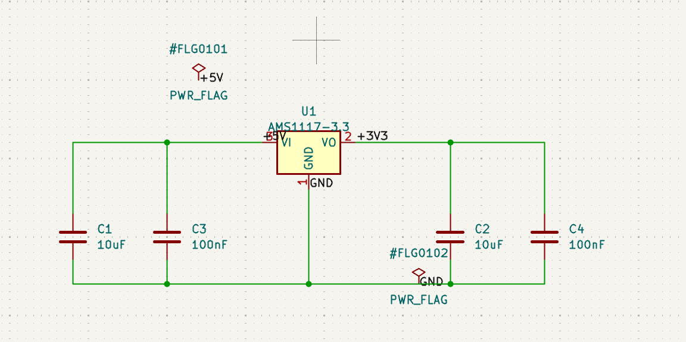
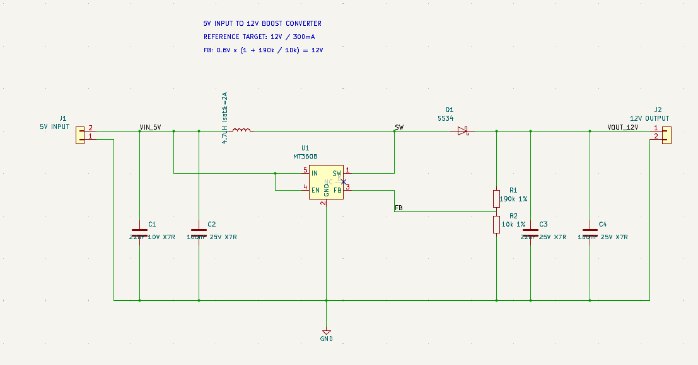

# KiCad Schematic Design Skill

An agent skill for creating, reviewing, and validating clear, electrically consistent KiCad schematics with Codex and Claude Code.

## Quick Start

Install the Skill globally for both Codex and Claude Code:

```bash
npx skills add Seahan1/kicad-agent --skill kicad-schematic-design -g -a claude-code -a codex -y
```

The command downloads the Skill from GitHub and installs it into the user-level directories for the selected agents. Restart Codex and Claude Code after installation so they reload the Skill metadata.

The `skills` CLI can also install the repository into a project-local agent directory when `-g` is omitted. The global command above is intended for repeated KiCad work across projects.

## Before and After: No Manual Edits

The screenshots below show the change in schematic workflow before and after applying this Skill, with no manual edits after generation. They are representative examples rather than a controlled benchmark with fixed timing data.

### Before using the Skill

<p></p>

### After using the Skill

<p></p>

| Dimension | Before using the Skill | After using the Skill |
| --- | --- | --- |
| Time to a reviewable schematic | Repeated manual drawing and late discovery of missing connections extend the path to review. | An endpoint ledger, staged checkpoints, and early library checks shorten the path to the first reviewable schematic. |
| Repeated error work | Interface omissions, power-symbol mistakes, and connectivity corrections can trigger repeated redraw cycles. | Explicit interface rules, standard power semantics, and localized checkpoint corrections reduce repeated error work. |
| Review coverage | Visual inspection can miss pin-to-net, footprint, or ERC issues. | ERC, structured analysis, footprint checks, and rendered review provide separate evidence before handoff. |

The improvement comes from front-loading circuit contracts and library checks, then validating each stage before adding more drawing content.

Both runs used GPT-5.6 Sol in Codex with High reasoning effort. No manual edits were made after generation.

## What It Does

- Creates new KiCad schematics from stated requirements.
- Edits existing schematics while preserving valid checkpoints.
- Places symbols from installed KiCad libraries.
- Defines connectors, ports, power rails, net labels, and ground returns.
- Verifies pin-to-net connectivity and component properties.
- Checks exact footprint availability and stops when a required footprint is missing.
- Runs KiCad format checks, ERC, schematic analysis, and rendered visual review.
- Reports assumptions, unresolved decisions, validation evidence, and changed-file diffs.

## Design Contract

Before drawing, the workflow records the circuit function, external endpoints, power requirements, assumptions, component identity, and manufacturing constraints.

Each physical external interface has one clear representation. A connector or explicit port defines a physical board connection. A net label identifies the connected net. A standalone power symbol defines a rail without a physical connector. These roles are kept distinct in the drawing.

Ground uses the standard `power:GND` symbol. Power and ground symbols are placed at wire endpoints or intentional junction branches. PWR_FLAG is reserved for ERC source declarations and is optional when the user chooses explicit interfaces with reviewed ERC findings.

## Footprint Policy

Every fabrication component must have a complete installed KiCad footprint matching its package, pin count, pad numbering, exposed-pad requirements, and assembly method.

When no exact footprint is available, the workflow stops immediately and reports the component, required package, searched libraries, and available choices. It does not silently substitute a similar footprint, leave the field blank, or create a guessed temporary footprint.

## Validation

The validation gate may include:

- Reopening the schematic in the installed KiCad version.
- Upgrading or resaving the KiCad file format.
- Running ERC with all severities enabled.
- Running structured schematic analysis.
- Auditing external interfaces, ground returns, and critical pin-to-net mappings.
- Confirming every assigned footprint exists in the installed libraries.
- Exporting a PDF or screenshot and inspecting the rendered drawing.
- Comparing schematic and PCB data when a PCB is in scope.

ERC and analyzer results are reported separately. A clean ERC result does not establish datasheet compliance, thermal margin, loop stability, physical pinout correctness, or manufacturing readiness.

## Skill Structure

```text
.agents/
└── skills/kicad-schematic-design/
    ├── SKILL.md
    └── agents/
        └── openai.yaml
```

- `SKILL.md` contains the operational rules and engineering workflow.
- `agents/openai.yaml` contains display metadata and the default prompt for Skill discovery.

## Example Requests

```text
Create a KiCad schematic for a 5V to 3.3V power supply.
Review this KiCad schematic for missing connections and incorrect power symbols.
Assign and verify footprints for every component in this schematic.
Open KiCad and check whether the input and output interfaces are clearly exposed.
Run ERC and explain every remaining violation.
```

## Related Standards

- [Agent Skills CLI](https://github.com/vercel-labs/skills)
- [OpenAI Skills Catalog](https://github.com/openai/skills)
- [Codex Skill Creator](https://github.com/openai/codex/tree/main/codex-rs/skills/src/assets/samples/skill-creator)
- [Agent Skills Open Standard](https://agentskills.io/)

## License

This project is licensed under the [MIT License](LICENSE).
